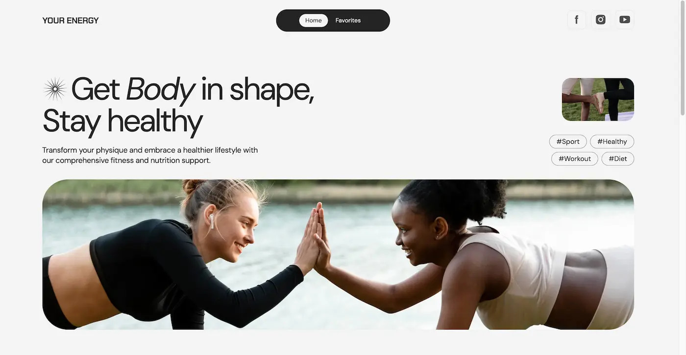
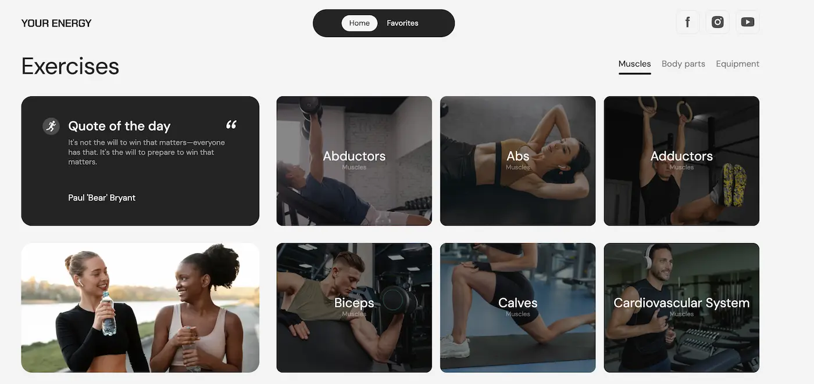
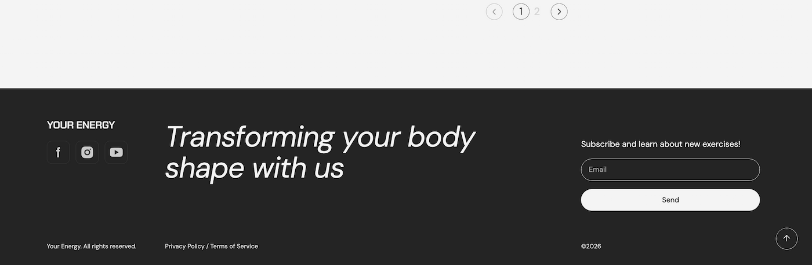
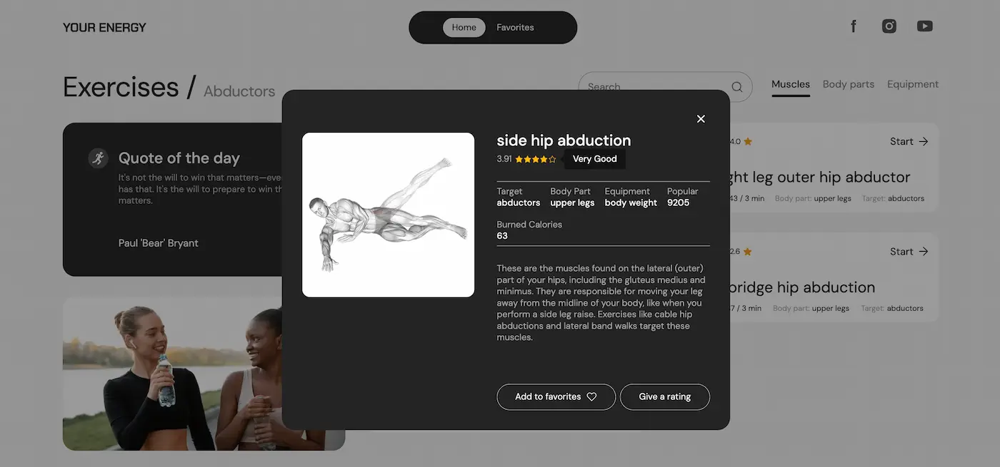
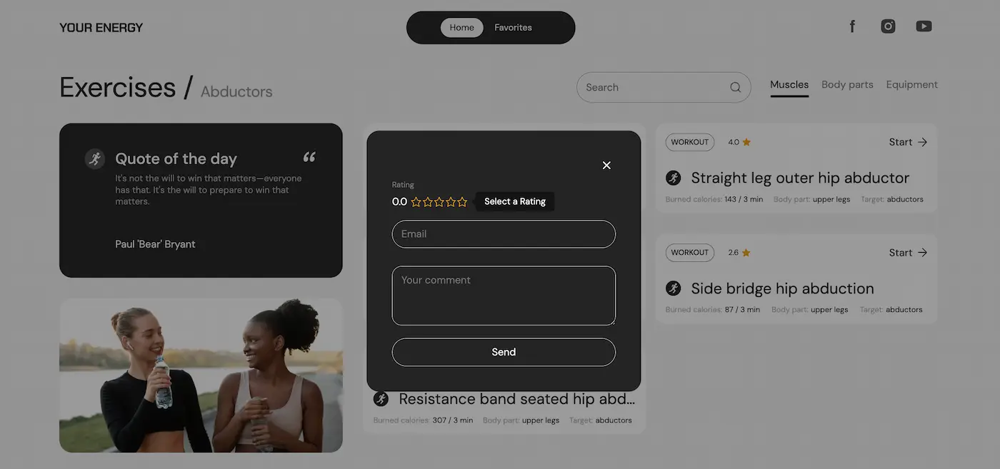
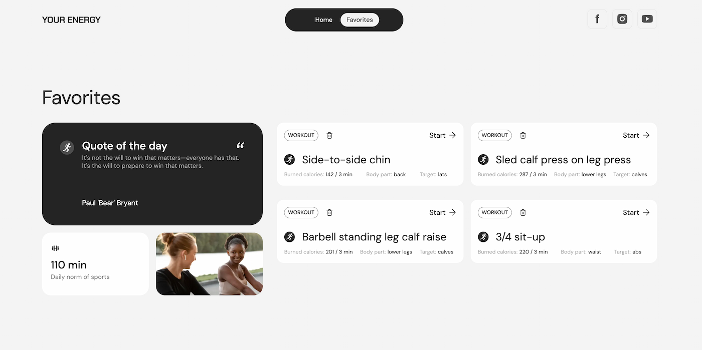

# 🏃 Your Energy

Фітнес-платформа для пошуку вправ за м'язами, частинами тіла чи обладнанням, з можливістю додавати вправи в улюблене та залишати рейтинг.

Фінальний груповий проєкт команди **GitFit**, виконаний у межах курсу **Advanced JavaScript** від GoIT.

🔗 **Живий сайт:** [danavykhovanets-hub.github.io/goit-advancedjs-finalproject-group_4](https://danavykhovanets-hub.github.io/goit-advancedjs-finalproject-group_4/)

---

## 👥 Команда GitFit

| Роль | Учасник |
|---|---|
| Team Lead | Дана Вихованець |
| Scrum Master | Ілона Нечипорук |
| Розробник | Олексій Копєйка |
| Розробник | Наталія Белодеденко |
| Розробник | Руслан Ступак |
| Розробник | Людмила Дейниченко |
| Розробник | Роман Падалка |
| Розробник | Юрій Голубенко |

---

## 🛠 Технології

- **Vite** — збірка проєкту
- **Vanilla JavaScript**
- **Axios** — HTTP-запити
- **iziToast** — сповіщення про помилки
- **star-rating.js** — рейтинг вправ
- **modern-normalize** — скидання стандартних стилів браузера
- **vite-plugin-html-inject** — модульна HTML-розмітка (partials)
- **vite-plugin-full-reload** — автооновлення сторінки при зміні HTML під час розробки
- **glob** — пошук HTML-файлів для збірки
- **PostCSS** (postcss-sort-media-queries) — сортування медіа-запитів

---

## ⚙️ Функціонал

### Header
- Логотип, навігація (Home / Favorites), посилання на соцмережі
- Адаптивне бургер-меню на мобільній версії

### Home
- **Hero-секція** із заголовком, тегами та зображеннями
- **Фільтри вправ** — за м'язами, частинами тіла, обладнанням
- **Список категорій/вправ** із пагінацією та пошуком за ключовим словом
- **Цитата дня** — підвантажується з бекенду й кешується в `localStorage` разом з датою (повторний запит не робиться, поки дата не зміниться)
- Інформаційний блок про 110 хв спорту на день

### Модальне вікно вправи
- Детальна інформація про вправу: відео (за наявності), назва, рейтинг, мета, задіяна частина тіла, калорії, опис
- Кнопка додавання в Favorites
- Кнопка **Give a rating** → відкриває форму рейтингу (радіокнопки + обов'язковий email з валідацією) → надсилає POST-запит на бекенд
- Закриття по кліку на backdrop, на іконку хрестика або по `Esc`

### Favorites
- Список вправ, доданих користувачем, зберігається в `localStorage`
- Порожній стан з повідомленням, якщо улюблених вправ ще немає

### Footer
- Логотип, соцмережі, слоган компанії
- Форма підписки на розсилку нових вправ (з валідацією email)

### Додатково
- **Loader** — спіннер для асинхронних запитів
- **Scroll up** — кнопка повернення нагору сторінки

### 🎁 Бонусні фічі (поза базовим ТЗ)
- Скролінг довгих цитат у блоці "Quote of the day" з фіксованою висотою
- Хештеги в Hero-секції (#Sport, #Healthy, #Workout, #Diet) та автор цитати — клікабельні посилання, що ведуть на відповідний пошук у Google

---

## 📸 Скріншоти

### 🖥 Desktop

**Home Page**







**Модальне вікно вправи**





**Favorites Page**



---

## 🔌 API

Базова документація: https://your-energy.b.goit.study/api-docs

| Метод | Опис | Endpoint |
|---|---|---|
| GET | Перелік фільтрів вправ | `/api/filters` |
| GET | Перелік вправ (з фільтрацією) | `/api/exercises` |
| GET | Детальна інформація про вправу | `/api/exercises/{exerciseID}` |
| PATCH | Додавання рейтингу вправі | `/api/exercises/{exerciseID}/rating` |
| GET | Цитата дня | `/api/quote` |
| POST | Підписка на розсилку | `/api/subscription` |

---

## 🚀 Запуск проєкту локально

```bash
git clone https://github.com/danavykhovanets-hub/goit-advancedjs-finalproject-group_4.git
cd goit-advancedjs-finalproject-group_4
npm install
npm run dev
```

Для production-збірки:
```bash
npm run build
```

---

## 📋 Статус проєкту

Проєкт виконано відповідно до ТЗ курсу Advanced JavaScript (GoIT), базова версія (MVP) + додаткові бонусні фічі.
